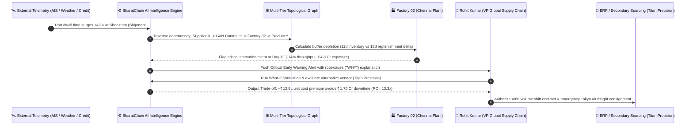

<div align="center">

# 🛡️ BharatChain AI
### Autonomous Supply Chain Risk Intelligence Platform

**“Predict supply-chain disruptions before they stop production.”**

[](https://react.dev/)
[](https://www.typescriptlang.org/)
[](https://nodejs.org/)
[](https://expressjs.com/)
[](https://tailwindcss.com/)
[](https://vitejs.dev/)
[](https://github.com/)
[](LICENSE)

*An enterprise-grade B2B SaaS platform engineered for discrete and process manufacturers, procurement directors, logistics operators, and global supply-chain executives.*

---

[Key Capabilities](#-key-capabilities) •
[System Architecture](#-system-architecture) •
[Disruption Flow](#-disruption-propagation-pipeline) •
[Quick Start](#-quick-start--installation) •
[API Reference](#-backend-restful-api-reference) •
[Project Structure](#-project-structure)

</div>

---

## 📋 Executive Summary

Global manufacturing supply chains lose over **$1.2 Trillion annually** to unpredicted cascading disruptions. Legacy ERP dashboards and supply-chain management (SCM) platforms operate reactively—notifying managers **after** a container is stuck at a port, a sole-source vendor defaults, or a factory assembly line runs out of critical sub-components.

**BharatChain AI** transforms supply chain risk from reactive firefighting into **predictive operational certainty**. By synthesizing real-time AIS maritime telemetry, weather anomalies, supplier financial Altman Z-scores, geopolitical chokepoints, and plant burn-rates, BharatChain AI continuously monitors the full lifecycle:

$$\text{Supplier} \longrightarrow \text{Raw Material} \longrightarrow \text{Component} \longrightarrow \text{Factory} \longrightarrow \text{Warehouse} \longrightarrow \text{Logistics} \longrightarrow \text{Customer}$$

It models and alerts operational directors to material deficits **10 to 25 days before physical assembly starvation**, providing quantified business trade-offs and automated mitigation playbooks.

---

## 🏛️ System Architecture

BharatChain AI is built on a clean, decoupled client-server architecture designed for high availability, low latency, and modular horizontal scaling.

```mermaid
graph TB
    subgraph Client_Tier ["🖥️ Client Presentation Tier (Port 5173)"]
        UI["React 19 SPA + Vite + TypeScript"]
        subgraph UI_Modules ["Core Feature Modules"]
            OV["Executive Overview Dashboard"]
            EW["AI Early Warning Engine"]
            SN["Topological Network Graph Engine"]
            GM["Geospatial Global Risk Map"]
            SI["Supplier Intelligence & Solvency Matrix"]
            IV["Inventory Burn-Down Monitor"]
            LG["AIS Freight & Port Congestion Hub"]
            SS["What-If Scenario Simulator"]
            AS["Alternative Sourcing Trade-off Engine"]
            CP["AI Supply Chain Copilot"]
            AC["4-Question Risk Alert Center"]
            RP["Board Dossier & Report Generator"]
        end
        State["AppContext (Dual Currency ₹ INR / $ USD + Real-Time Telemetry)"]
        UI --> State
        State --> UI_Modules
    end

    subgraph API_Gateway ["🚪 API & Middleware Gateway (Port 5000)"]
        Exp["Express.js Server"]
        Cors["CORS + JSON Body Parser"]
        Log["Request Dwell & Access Logger"]
        Router["/api Route Dispatcher"]
        Exp --> Cors --> Log --> Router
    end

    subgraph Intelligence_Engine ["🧠 AI & Analytics Decision Engine"]
        Bayes["Bayesian Causal Disruption Evaluator"]
        SimEngine["Non-Linear Production Impact Modeler"]
        Tradeoff["Dual-Sourcing Optimization Engine"]
        NLP["Structured Copilot Reasoner (Finding, Evidence, Impact, Rec)"]
    end

    subgraph Data_Layer ["💾 Enterprise Domain Layer"]
        Suppliers["52 Global & Indian Suppliers"]
        Components["102 BOM Catalog Components"]
        Factories["20 Manufacturing Hubs"]
        Shipments["Active AIS Maritime & Air Consignments"]
        Ports["Global Port Congestion Index"]
        Incidents["Operational Disruption Feeds"]
    end

    UI_Modules -->|RESTful JSON / Telemetry Ingestion| API_Gateway
    Router --> Intelligence_Engine
    Intelligence_Engine --> Data_Layer
```



---

## 🔄 Disruption Propagation Pipeline

When an upstream threat triggers anywhere in the world (e.g., typhoon warning at Yantian Port, Shenzhen), the event propagates through the topological dependency engine to compute downstream assembly line and revenue liabilities in real time.



---

## 🔁 Signature 6-Stage Resilience Operational Loop

BharatChain AI enforces a closed-loop operational workflow designed into the interface navigation:

| Stage | Action | Description | Output Artifact |
|:---:|:---:|---|---|
| **01** | **DETECT** | Ingest raw streaming signals across satellite AIS, marine dwell times, weather patterns, and supplier credit lines. | Real-time Incident Feed |
| **02** | **PREDICT** | Bayesian causal models forecast plant starvation and material deficit horizons 10–25 days ahead. | Disruption ETA & Confidence % |
| **03** | **UNDERSTAND** | Surface multi-variable root cause telemetry answering exactly **WHY** the threat exists. | Multi-Tier Root Cause Breakdown |
| **04** | **SIMULATE** | Run non-linear what-if stress tests across duration (1–90 days) and capacity loss (20–100%). | Production Impact % & Revenue at Risk |
| **05** | **RECOMMEND** | Algorithmic secondary vendor matching with financial trade-off balance sheet calculation. | ROI Multiplier & Volume Split % |
| **06** | **ACT** | One-click generation of ERP purchase orders, expedited air cargo bookings, and line re-sequencing. | Executed Work Orders & PDF Dossiers |

---

## ✨ Key Capabilities

### 1. 📊 Executive Overview Dashboard
- High-level C-suite KPI cards:
  - **Overall Enterprise Risk**: `72 / 100` (High Risk status)
  - **Suppliers at Risk**: `18` of 52 monitored (5 Critical)
  - **Components at Risk**: `34` of 102 parts (14 Single Source vulnerabilities)
  - **Production Value Exposure**: `₹8.4 Cr` ($10.1M) across 3 affected plants
  - **Stockout Risk**: `7 Finished Products` (32,400 customers exposed)
  - **Critical Alerts**: `5 Urgent` requiring executive sign-off
- 30-Day Risk Trend Chart comparing Composite Risk vs Logistics Risk vs Supplier Risk against the enterprise safety threshold (`45`).
- Interactive Global Risk Map preview and live high-risk supplier ranking.

### 2. ⚡ AI Early Warning System
- **Predictive Horizon**: Alerts production teams **12 days** prior to physical material exhaustion.
- **Root-Cause Telemetry ("WHY" Engine)**: Explains the causal chain—e.g., Pearl River Delta storm surge $\to$ Yantian dwell time +42% $\to$ transit delay +7d $\to$ safety buffer 11d.
- **Action Triggers**: Direct links to `View Impact Path`, `Simulate Response`, and `Create Action`.

### 3. 🕸️ Interactive Supply Chain Network (Signature Feature)
- Dynamic multi-tier topological graph:
  $$\text{Tier 1 Supplier} \to \text{Raw Material / Component} \to \text{Factory Hub} \to \text{Finished Product} \to \text{Distribution Warehouse} \to \text{End Customers}$$
- **Cascading Downstream Highlight**: Selecting any node (e.g., *Supplier X / Shenzhen Micro*) instantly illuminates the complete downstream impact path:
  $$\text{Supplier X} \longrightarrow \text{Component A (Power Controller)} \longrightarrow \text{Factory 02} \longrightarrow \text{Product Y (EV Powertrain)} \longrightarrow \text{12,400 Customers}$$
- Displays Disruption ETA, Revenue at Risk, Inventory Remaining, and Risk Classification.

### 4. 🗺️ Global Geospatial Risk Map
- Interactive vector geo-projection mapping global logistics corridors, shipping ports, supplier clusters, and manufacturing gigafactories.
- Real-time hotspots: Shenzhen (Risk 87), JNPT Mumbai (Risk 68), Chennai Gigafactory (Risk 85), Hsinchu (Risk 74), Tokyo-Nagoya (Risk 32), Stuttgart (Risk 24), Detroit (Risk 41).
- Drilldown telemetry side-panel revealing localized congestion, weather advisories, and delayed consignments.

### 5. 🏢 Supplier Intelligence & Solvency Matrix
- 9-Column high-density enterprise table:
  `Supplier | Country | Risk Score | Delivery Performance | Financial Risk | Logistics Risk | Capacity | Components | Status`
- Multi-column sort, multi-level risk filtering, country segmentation, and instant search.
- **Supplier Detail Profile**: 7-dimension risk radar (Financial, Delivery, Geopolitical, Weather, Transportation, Cyber, Capacity) + 6-month historical trend.

### 6. 📦 Inventory Risk & Stockout Prediction
- Component-level burn telemetry tracking:
  `Current Inventory | Daily Consumption | Incoming Supply | Days Remaining | Expected Stockout`
- Featured indicator: **Power Controller 800V GaN** (18,000 units on hand, 1,500 units/day burn, 12 days coverage vs 15 days supplier transit delay $\to$ **🔴 Stockout likely**).

### 7. 🚢 Logistics & Maritime Freight Telemetry
- Active consignment tracking featuring **Shipment #SC48291** (Shenzhen $\to$ Mumbai, Original ETA 18 Sep, Updated ETA 25 Sep, +7 days delay, Power Controller).
- Global Port Congestion Live Index: Shenzhen (8.7/10), Kaohsiung (7.9/10), Singapore (7.2/10), JNPT Mumbai (6.8/10), Rotterdam (5.4/10).

### 8. 🎛️ What-If Scenario Stress Testing Simulator
- Interactive disruption parameter modeling: Supplier Failure, Delivery Delay, Port Closure, Factory Shutdown, Commodity Price Shock, Transport Disruption, Demand Spike.
- Dynamic duration (1–90 days) and severity (20–100%) sliders.
- **Instant Calculated Outcomes**:
  - Production Output Impact: **-14%**
  - Direct Revenue at Risk: **₹8.2 Cr** ($9.8M)
  - Impacted Commercial Deliveries: **12,400 customers**
  - Additional Expedited Procurement Cost: **₹34 L** ($41K)
- 30-Day Assembly Throughput comparison curves (Baseline vs Unmitigated vs Mitigated).

### 9. ⚖️ Alternative Sourcing & Trade-off Engine
- Head-to-head vendor evaluation: Current Risky Supplier (*Supplier X*, Risk 86, Cost ₹100, Lead 18d) vs AI-Recommended Qualified Backup (*Supplier Z / Titan Precision*, Risk 21, Cost ₹108, Lead 7d, Capacity 68%).
- Dynamic volume allocation slider (10% to 80%) with live ROI calculation:
  - Additional procurement expense: **₹12.8 L**
  - Avoided factory downtime penalty: **₹1.70 Cr**
  - **Net Financial Protection Multiplier**: **13.3x ROI**

### 10. 🤖 AI Supply Chain Copilot
- Executive reasoning assistant engineered with **structured enterprise outputs** (no generic chatbot aesthetics):
  - **Finding**: High-level diagnostic synthesis.
  - **Evidence**: Specific data points, container dwell numbers, and financial metrics.
  - **Impact**: Quantified production line and customer delivery exposure.
  - **Recommendation**: Pragmatic operational mitigation steps.
  - **Action Buttons**: `Simulate Response`, `Create Action`, `View Supplier Profile`.
- One-click prompt chips for board inquiries (*"Which suppliers are most dangerous right now?"*, *"What happens if Supplier X fails?"*, *"Find all single-source components"*).

### 11. 🚨 Risk Alert Center (4-Question Framework)
- Categorized by severity (Critical, High, Medium, Low).
- Every incident answers four executive questions:
  1. *What happened?*
  2. *Why does it matter?*
  3. *When could it impact production?*
  4. *What should we do?*

### 12. 📑 Executive Audit Reports & Dossiers
- Standardized C-suite briefing documents: Daily Disruption Report, Supplier Solvency Audit, Plant Production Exposure, Logistics Report, Board Executive Summary.
- One-click **PDF Print Formatting** and **CSV Telemetry Export**.

---

## 🎨 Enterprise Design System Standards

BharatChain AI adheres strictly to institutional enterprise design principles:

- **Theme**: Light theme default utilizing clean slate/zinc neutral surfaces (`#f8fafc` to `#0f172a`).
- **Typography**: Inter for high-legibility interface typography; JetBrains Mono for monetary values, part numbers, and coordinates.
- **Information Density**: Compact spacing, subtle 1px enterprise borders (`#e2e8f0`), zero drop shadows or frivolous animations.
- **Strict Semantic Palette**:
  - 🟢 **Low Risk**: `#16a34a` (Emerald-600)
  - 🟡 **Medium Risk**: `#d97706` (Amber-600)
  - 🟠 **High Risk**: `#ea580c` (Orange-600)
  - 🔴 **Critical Risk**: `#dc2626` (Red-600)
  - 🔵 **Information**: `#0284c7` (Sky-600)
- **Dual Currency Engine**: Instant global toggling between **₹ INR** (Crores `Cr` / Lakhs `L`) and **$ USD** (Millions `M` / Thousands `K`) across every KPI card, chart, and simulation.

---

## 📂 Project Structure

```text
BharatChain AI/
├── frontend/                         # Client Tier (React 19 + Vite + TypeScript)
│   ├── public/                       # Static brand assets & SVGs
│   ├── src/
│   │   ├── components/
│   │   │   ├── common/               # ToastContainer, Modal dialogs
│   │   │   ├── copilot/              # AiCopilotDrawer (Structured reasoning)
│   │   │   ├── landing/              # LandingPage (Commercial public site)
│   │   │   ├── layout/               # Sidebar, TopNav, NotificationsDrawer
│   │   │   └── views/                # Core platform module views
│   │   │       ├── AlertCenter.tsx           # 4-Question incident center
│   │   │       ├── AlternativeSuppliers.tsx  # Dual-sourcing trade-off engine
│   │   │       ├── ComponentsList.tsx        # BOM catalog & single-source
│   │   │       ├── EarlyWarnings.tsx         # AI predictive warnings & root causes
│   │   │       ├── ExecutiveOverview.tsx     # C-suite overview & KPIs
│   │   │       ├── FactoriesList.tsx         # Assembly plant capacity & exposure
│   │   │       ├── GlobalRiskMap.tsx         # Interactive geospatial map
│   │   │       ├── InventoryRisk.tsx         # Burn rates & stockout prediction
│   │   │       ├── LogisticsIntelligence.tsx # AIS freight tracker & ports
│   │   │       ├── ReportsView.tsx           # Executive dossiers & PDF/CSV
│   │   │       ├── RiskAnalytics.tsx         # Executive charts & trends
│   │   │       ├── ScenarioSimulator.tsx     # What-If stress testing model
│   │   │       ├── SupplierDetailModal.tsx   # 7-dimension risk radar
│   │   │       └── SuppliersList.tsx         # 9-column supplier matrix
│   │   ├── context/
│   │   │   └── AppContext.tsx        # State management (Currency, Navigation, Alerts)
│   │   ├── data/
│   │   │   └── mockData.ts           # 52 Suppliers, 102 Parts, 20 Plants, 30 Products
│   │   ├── types/
│   │   │   └── index.ts              # Core domain TypeScript interfaces
│   │   ├── utils/
│   │   │   └── formatters.ts         # Currency & risk badge utilities
│   │   ├── App.tsx                   # App shell router & view switcher
│   │   ├── index.css                 # Tailwind directives & enterprise scrollbars
│   │   └── main.tsx                  # React DOM entrypoint
│   ├── index.html                    # Application HTML template
│   ├── package.json                  # Frontend dependencies
│   ├── postcss.config.js             # PostCSS Tailwind plugins
│   ├── tailwind.config.js            # Design tokens & semantic colors
│   ├── tsconfig.json                 # TypeScript project configuration
│   └── vite.config.ts                # Vite bundler configuration
│
├── backend/                          # Server Tier (Node.js + Express + TypeScript)
│   ├── src/
│   │   ├── data/
│   │   │   └── mockData.ts           # Enterprise database repository
│   │   ├── routes/
│   │   │   └── api.ts                # RESTful endpoints (/api/overview, /api/simulate...)
│   │   ├── types/
│   │   │   └── index.ts              # Shared domain contracts
│   │   └── server.ts                 # Express entrypoint, CORS, logging
│   ├── package.json                  # Backend dependencies
│   └── tsconfig.json                 # NodeNext TypeScript configuration
│
├── package.json                      # Root workspace script orchestrator
└── README.md                         # Enterprise platform documentation
```

---

## 🚀 Quick Start & Installation

### Prerequisites
- **Node.js**: v18.0.0 or higher (`node -v`)
- **npm**: v9.0.0 or higher (`npm -v`)

### 1. Clone & Install Workspace
```bash
git clone https://github.com/your-org/bharatchain-ai.git
cd bharatchain-ai

# Install root dependencies and both workspaces
npm run install:all
```

*Or install each package independently:*
```bash
cd frontend && npm install
cd ../backend && npm install
```

---

### 2. Run the Development Servers

You can launch both services concurrently or run them in separate terminals.

#### Terminal 1 — Backend API Server (Port 5000)
```bash
cd backend
npm run dev
```
Server will start at: **`http://localhost:5000`**

#### Terminal 2 — Frontend Application (Port 5173)
```bash
cd frontend
npm run dev
```
Client application will open at: **`http://localhost:5173`**

#### Root Convenience Shortcuts (From Repository Root)
```bash
npm run dev:frontend    # Launch frontend dev server
npm run dev:backend     # Launch backend API server
npm run build           # Compile both backend and frontend bundles
```

---

### 3. Build for Production

```bash
# Build backend
cd backend
npm run build
npm run start           # Runs production server from dist/server.js

# Build frontend
cd frontend
npm run build
npm run preview         # Previews production bundle at http://localhost:5173
```

---

## 🔌 Backend RESTful API Reference

The backend exposes a clean JSON REST API on port `5000`:

| Method | Endpoint | Query / Body Params | Description |
|---|---|---|---|
| `GET` | `/api/health` | — | System health, service status, and active monitored entity counts. |
| `GET` | `/api/overview` | — | Executive KPIs, 30-day composite risk trends, and user profile information. |
| `GET` | `/api/early-warnings` | `?severity=critical\|high` | Predictive disruption warnings with causal telemetry and root-cause factors. |
| `GET` | `/api/suppliers` | `?search=&country=&risk=&status=` | 52 suppliers directory with multi-parameter search, sort, and risk filtering. |
| `GET` | `/api/suppliers/:id` | — | Single supplier profile, 7-dimension risk radar, and affected plant/BOM linkages. |
| `GET` | `/api/components` | `?category=&singleSource=true` | 102 components catalog with burn rates, days remaining, and stockout flags. |
| `GET` | `/api/factories` | — | 20 manufacturing hubs with capacity utilization and direct revenue liabilities. |
| `GET` | `/api/shipments` | `?status=Delayed` | Active freight tracking with delay deltas, carrier data, and global port index. |
| `POST` | `/api/simulate` | `{ scenarioType, durationDays, severityPct }` | **What-If Engine**: Computes production drop %, revenue at risk, and playbooks. |
| `GET` | `/api/alternatives` | — | Dual-sourcing trade-off comparison matrix and financial balance sheets. |
| `POST` | `/api/copilot` | `{ query: "What happens if Supplier X fails?" }` | **AI Reasoning Engine**: Returns structured `Finding`, `Evidence`, `Impact`, `Rec`. |
| `GET` | `/api/alerts` | `?severity=critical` | Incident alerts categorized under the structured 4-question framework. |

#### Sample Response: `GET /api/health`
```json
{
  "status": "healthy",
  "timestamp": "2026-09-13T17:00:00.000Z",
  "service": "BharatChain AI Enterprise Engine",
  "version": "4.2.0",
  "monitoredNodes": {
    "suppliers": 52,
    "components": 102,
    "factories": 20,
    "products": 30,
    "shipments": 7
  }
}
```

---

## 👤 Enterprise User Profile

The platform is configured for leadership operations:

- **Executive Lead**: **Rohit Kumar**
- **Avatar Initials**: **`RK`**
- **Title**: **VP Global Supply Chain**
- **Corporate Entity**: **Bharat Mobility & Industrial Group** (EV & Powertrain Division)
- **Authority Scope**: 52 Tier-1/2 Suppliers, 20 Assembly Plants, Global Air/Sea Freight Lanes
- **Signoff Authority**: Primary signoff on executive resilience dossiers and dual-sourcing reallocations.

---

## 🔒 Security, Compliance & Data Governance

- **Encryption**: TLS 1.3 in-transit encryption and AES-256 for resting risk telemetry.
- **Audit Logging**: Immutable timestamped change-logs for every simulation, allocation shift, and mitigation order.
- **Role-Based Access Control (RBAC)**: Segregation between Procurement Officers, Plant Managers, and C-Suite Executives.
- **Standards Alignment**: Aligned with **SOC 2 Type II**, **ISO 27001**, and automotive supply-chain quality standard **IATF 16949**.

---

<div align="center">

**BharatChain AI — Supply Chain Risk Intelligence**  
*Predict supply-chain disruptions before they stop production.*  


</div>
